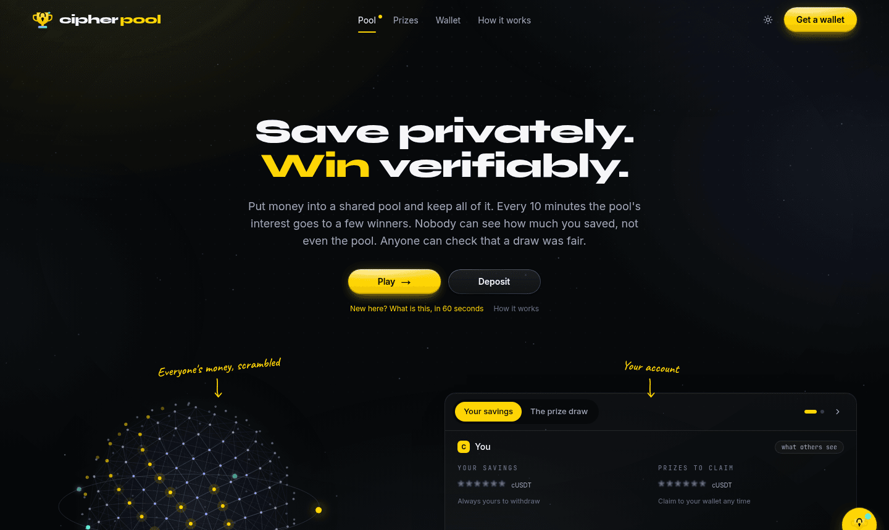
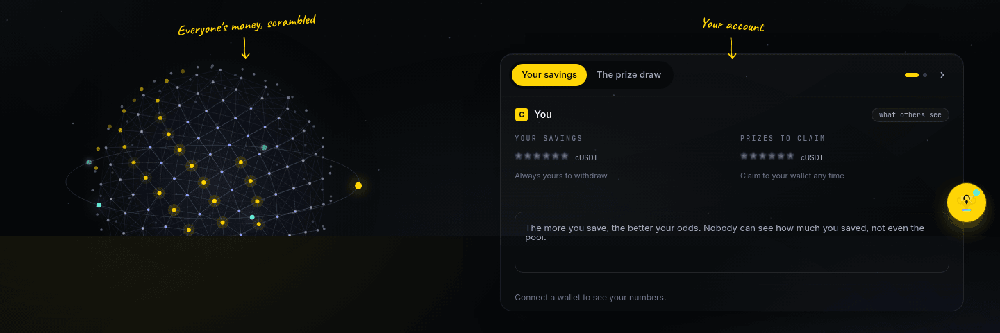
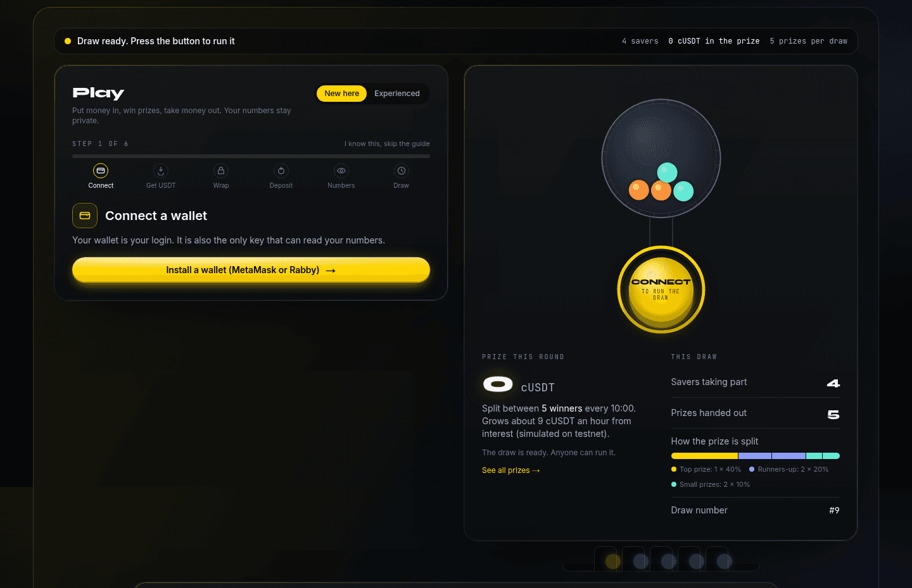
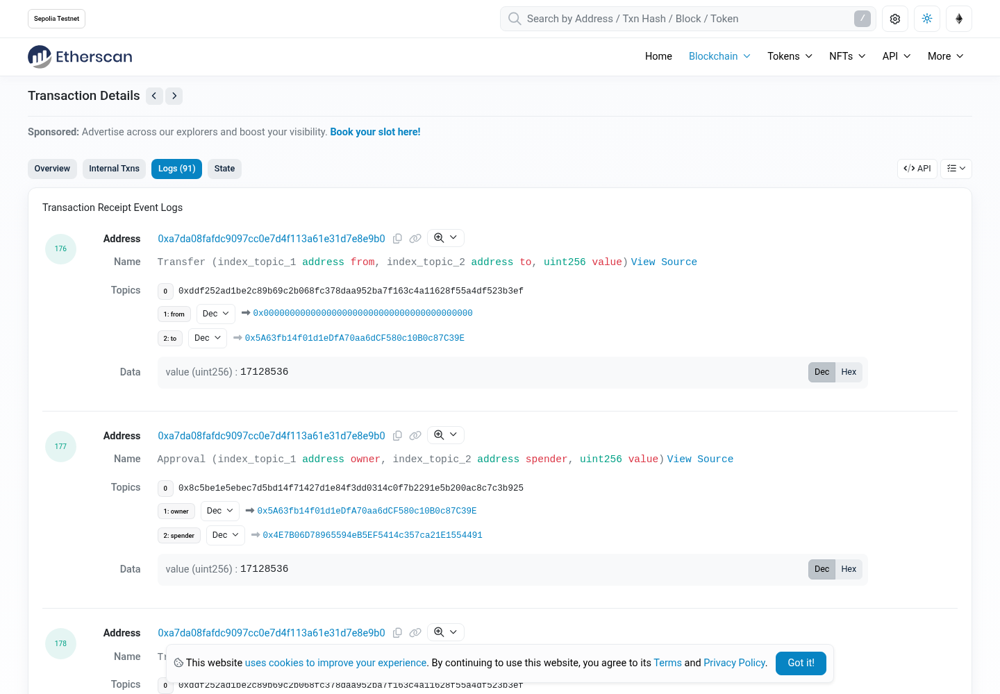
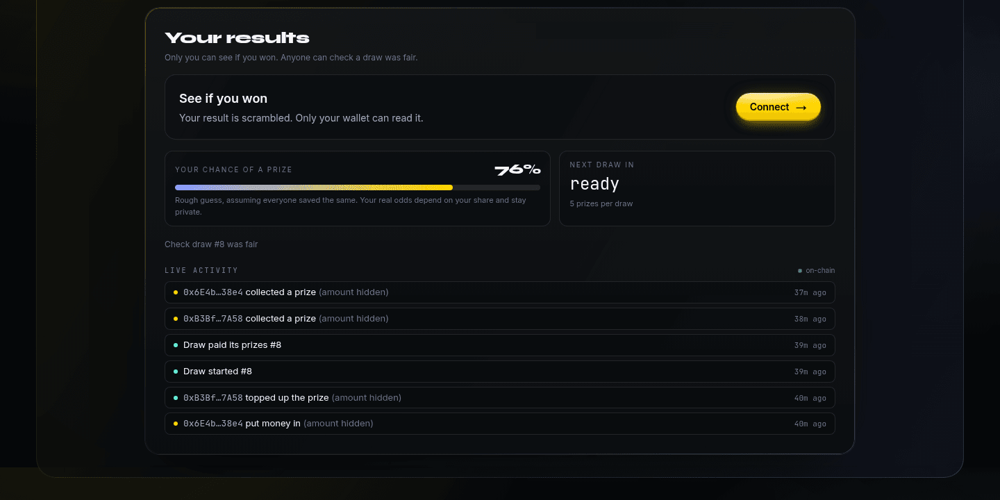
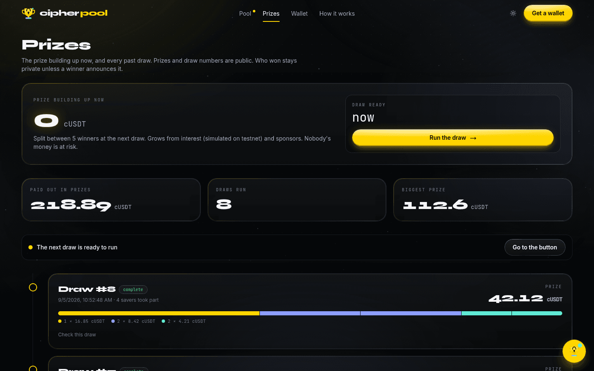
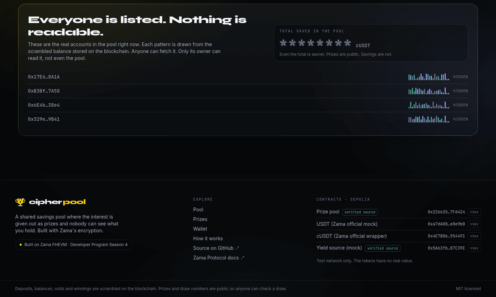
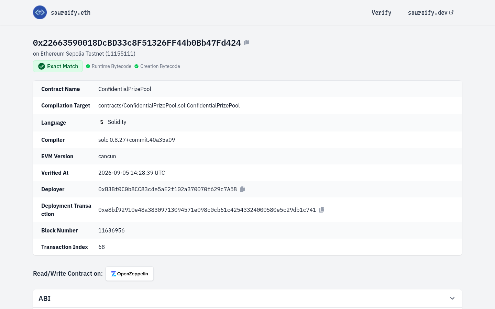
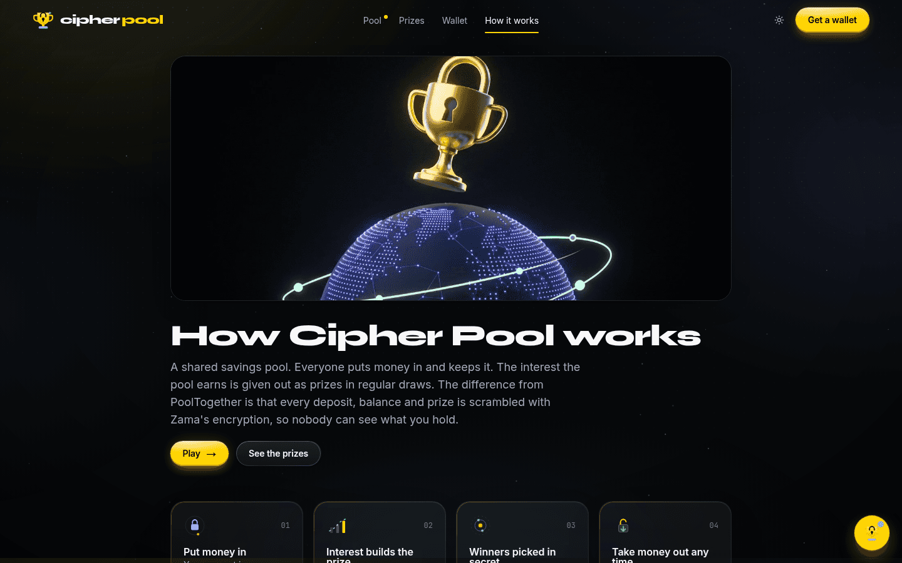
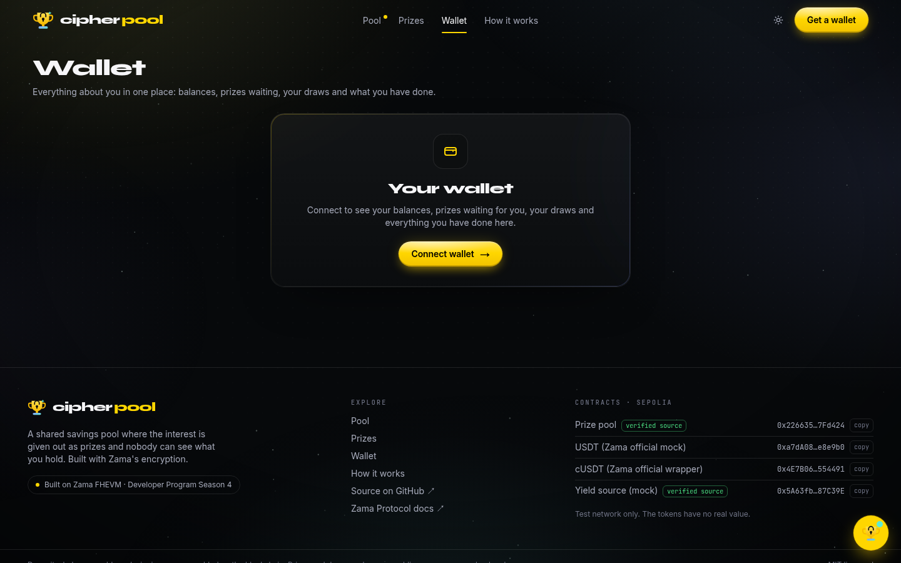

# Cipher Pool — demo video storyboard

Target length: about 3 minutes (2:50 to 3:20 is fine). One real person on camera at the start and end, screen recording in between. Screenshots below are from the live site at https://cipher-pool-beta.vercel.app on 5 Sep 2026 and show exactly which screen and which element each shot is about. Where a shot needs a connected wallet, the screenshot shows the disconnected version and the text says what will appear once you are connected.

## Before you press record

- Browser at 1440 × 900, bookmarks bar hidden, dark theme, sound off (the app's sound kit is off by default).
- Two accounts in Rabby: **A** = deployer `0xB3Bf…7A58` (0.14 Sepolia ETH) and **B** = demo `0x6E4b…38e4` (0.006 ETH, enough to claim, not to run a draw). Both are already savers from previous rounds, so both are in the next draw.
- Money put in during a round counts from the round after. So the on-camera deposit will not be in the on-camera draw, but A and B's existing positions will. The script is written for that and says so.
- Open these tabs in advance: the app, Sepolia Etherscan for the pool `0x22663590018DcBD33c8F51326FF44b0Bb47Fd424`, and the verified source https://repo.sourcify.dev/11155111/0x22663590018DcBD33c8F51326FF44b0Bb47Fd424.
- Start the screen-recorded part when the countdown on the status bar reads about 2:30. The deposit scenes take about 90 seconds, which lands you at the button right as it turns yellow. If the countdown has already hit zero, that is fine too: the button simply reads RUN DRAW.
- Record the whole thing in one take if you can. Small stumbles are fine. Cut only between the camera parts and the screen part.

---

## 0:00 – 0:20 · On camera · The pitch

**Shot:** you, straight to camera. No screen yet.

**Say:**

> Hi, I'm Daniel. This is Cipher Pool. It's a prize savings pool, like PoolTogether. You put money in, you keep all of it, and every round the interest is handed out as prizes. The difference is that nobody can see how much anyone saved. Not other users, not me, not even the contract. Every balance is encrypted with Zama's FHE. Let me show you the whole thing live on Sepolia.

---

## 0:20 – 0:40 · Screen · The home page

**Shot:** the top of the app. Move the mouse slowly across the sphere so it reacts, then rest on the account card.

**Point at:** the headline, then the sphere caption "Everyone's money, scrambled", then the account card where savings and prizes show as blurred asterisks.

**Say:**

> This is the pool. Every point on this sphere is a saver's encrypted deposit. On the right is what anyone can see about an account before it's unlocked: nothing. Those asterisks are real encrypted values sitting on the blockchain. Only the owner's wallet can turn them back into numbers.

---

## 0:40 – 1:05 · Screen · Connect, get test money, wrap it

**Shot:** scroll to the Play section. Leave "New here" selected so the guided steps are visible.

**Do, in order:**

1. Click **Connect** in the top right, pick account **A** in Rabby.
   *What appears:* the header shows your identicon and address, the wizard jumps to Step 2, "Get 1,000 test USDT".
2. Press **Get 1,000 test USDT**. Confirm in Rabby.
   *What appears:* status line "Minting 1,000 test USDT from Zama's official mock…", then "Confirmed. Reading your new balance…", then the green tick "1,000 test USDT is in your wallet." The wizard moves to Step 3 by itself.
3. Press **Wrap 1,000 USDT into cUSDT**. Confirm the approval, then the wrap.
   *What appears:* "Wrapping into cUSDT on Zama FHEVM, your balance becomes encrypted…", then the wizard moves to Step 4.

**Say (over the clicks):**

> First I connect. Then I grab some test USDT from Zama's official faucet token. This is a normal ERC-20, everyone can see it. Now I wrap it into cUSDT, Zama's confidential token. From this point on, every amount is a ciphertext. The wallet balance you'd normally see on a block explorer is gone.

---

## 1:05 – 1:30 · Screen · Deposit, then unlock your own numbers

**Do, in order:**

1. Step 4: type **300**, press **Put in 300 cUSDT**. Confirm in Rabby (a one-time operator approval first, then the deposit).
   *What appears:* "Encrypting with Zama's FHE key…", "Sending your encrypted deposit to the pool on Zama FHEVM…", then the tick "Done. Your money is in the pool, scrambled." Coins fly from the form into the sphere. The wizard moves to Step 5.
2. Step 5: press **Show my numbers**. Sign the one message in Rabby.
   *What appears:* the asterisks in the balance strip unscramble into real figures: savings **300**, wallet cUSDT **700**. The wizard moves to Step 6, which shows the countdown.
3. Switch to the Etherscan tab, open the deposit transaction, click **Logs**.

**Point at:** the event addresses. Besides the pool, logs come from `0xf0Ff…433D` (Zama's ACL) and `0x92C9…c127` (Zama's coprocessor). No log carries an amount.

**Say:**

> I put in 300. The amount is encrypted in my browser before it ever leaves, so the transaction carries a ciphertext, not a number. To read my own balance I sign one message, Zama's relayer checks that my wallet is allowed, and only then do I get the plain figure. Here's the transaction on Etherscan. Look at the logs: my pool talks to Zama's ACL and coprocessor on every call, and there's no amount anywhere.

---

## 1:30 – 1:50 · Screen · A second saver and a sponsor

**Do, in order:**

1. In Rabby switch to account **B**. The app updates by itself.
   *What appears:* the wizard shows B's own progress; B is already a saver, so it lands on the last step.
2. Click **Experienced**. Tab **Deposit**: type **100**, press **Deposit 100 cUSDT**. Confirm.
3. Switch back to account **A**. Experienced, tab **Add to prize**: type **25**, press **Add 25 cUSDT**. Confirm.
   *What appears:* the status bar at the top of the Play section shows the prize going up by 25, because the prize is the one number the pool makes public on purpose.

**Say:**

> Here's a second saver putting in 100. Same thing, encrypted. And from my first account I'll sponsor 25 into the prize. Notice the prize figure updates in public. That's deliberate: the prize is public, the savers are not. One rule worth knowing: money added during a round joins the draw after this one, so nobody can jump in seconds before a draw with a huge amount and jump out after.

---

## 1:50 – 2:25 · Screen · Run the draw, see the result, collect

**Shot:** the draw chamber. The status bar reads "Draw ready. Press the button to run it" and the big button is lit yellow, RUN DRAW.

**Do, in order (account A):**

1. Press and **hold** the big button for one second. Confirm "startDraw" in Rabby, then each "advanceDraw" batch as it asks (two or three confirmations).
   *What appears:* the drum spins, the saver balls tumble, the status line narrates "Zama's coprocessor is drawing the encrypted random seeds…", then "Selecting the winner over encrypted balances", then "Crediting the prize to the encrypted winner". When it finishes the prize balls drop down the chute into the tray and the sphere flashes.
2. Scroll down to **Your results**. Press **Did I win?** Sign once if asked.
   *What appears:* the reel spins and lands on either a prize amount or "Not this time". Either result is a good result on camera; say the matching line below.
3. If A won: press **Collect to wallet**, confirm. *What appears:* "Sending your prize by confidential transfer on Zama FHEVM…", then "Collected." Switch to B and repeat **Did I win?** for a second data point. If A did not win, switch to B and check there.

**Say (while the draw runs):**

> The countdown is at zero, so anyone can run the draw. I'll hold the button. The pool pulls in the interest, draws encrypted random seeds through Zama's coprocessor, and walks every saver's encrypted balance to pick the winners. Bigger savers have better odds, but the pool never decrypts anyone. It's done in small batches so it works with any number of savers.

**Say (at the result), pick one:**

> Now the part only I can see. "Did I win?" decrypts my own result. There it is. I'll collect it, and that's a confidential transfer, so even the payout amount stays hidden.

> Not this time for this account. Let me check the other one. The important bit: from the outside, both accounts look identical. Every saver gets an encrypted result written, winners and non-winners alike, so nobody can tell who won by watching the chain.

---

## 2:25 – 2:45 · Screen · Anyone can verify, nobody can peek

**Do, in order:**

1. Click **Prizes** in the header.

   **Point at:** the draw you just ran at the top of the list, its public prize and how it was split. Click **Check this draw** to open the seeds.
2. Back on **Pool**, scroll to **Everyone is listed. Nothing is readable.** Click any saver row that is not yours, press **Try to read it**.

   *What appears:* the relayer's refusal, word for word, because your wallet is not allowed to decrypt that handle.
3. Point at the footer: **verified source** next to the prize pool. Optionally flash the Sourcify tab.

**Say:**

> Everything you'd want to audit is public: the prize, the seeds, the number of savers. Anyone can check a draw was done honestly. Everything about a person is private. Here I'm trying to read another saver's balance, and Zama's relayer refuses. The contract source is verified, so you can read exactly what runs.

---

## 2:45 – 3:05 · On camera · Close

**Shot:** you, straight to camera.

**Say:**

> So that's Cipher Pool. Deposits, balances, odds, and winnings are all encrypted end to end with Zama's FHEVM, using Zama's official confidential USDT. Prizes and draws are public so anyone can verify them. The prize interest is a mock on testnet; swap in a real yield adapter and this is ready for a mainnet cUSDT pool. Code, live app, and the verified contracts are linked below. Thanks for watching.

---

## Optional cutaways if you have spare seconds

- **How it works page** (Prizes → How it works): a 3-second pan over the four steps for people who like diagrams.

  

- **Wallet page**: your balances, prizes waiting, and your draw history in one place.

  

- **Mobile**: the app has a bottom tab bar and full mobile layout. Hold your phone up to the camera for two seconds.

## Links to put in the video description

- Live app: https://cipher-pool-beta.vercel.app
- Source: https://github.com/DannyTrillion/cipher-pool
- Verified pool contract: https://repo.sourcify.dev/11155111/0x22663590018DcBD33c8F51326FF44b0Bb47Fd424
- Pool on Etherscan: https://sepolia.etherscan.io/address/0x22663590018DcBD33c8F51326FF44b0Bb47Fd424
